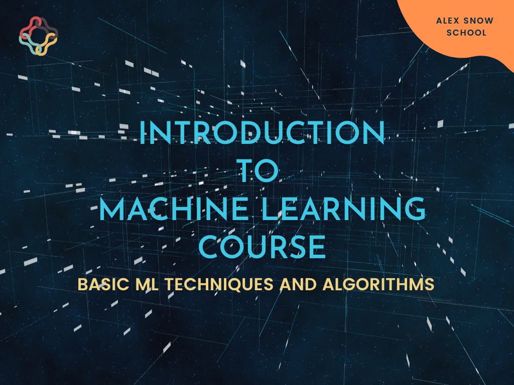

[**Alex Snow School**](https://www.alexsnowschool.org/) က ခုဆိုရင်  Introduction to Machine Learning Course ကို အသစ်ဖွင့်လှစ်ပြီဖြစ်ပါတယ်။
တက်ရောက်သင့်သူတွေက -
- AI/Machine Learning ဆိုတာ စတင်လေ့လာချင်တဲ့သူတွေ
- AI/Machine Learning ဘာလဲဆိုတာ concept နဲ့သေချာသိလိုတဲ့သူတွေ
- Trend ဖြစ်နေတဲ့ နယ်ပယ်ကို မြည်းစမ်းလိုတဲ့သူတွေ 
အတွက်ဖြစ်ပါတယ်။

Course ကို အရမ်း မကြီးလွန်း မသေးလွန်းဖြစ်ဖို့အတွက် ပြင်ဆင်ထားပါတယ်။ Concept ပိုင်းကို သေချာ အာရုံစိုက်ပေးမယ့်အပြင် Mini-task လေးတွေလည်း လုပ်ရမှာပါ။ Mini-task ဆိုပေမယ့် concept တွေ နိုင်နင်းမှ လုပ်နိုင်မှာပါ။

